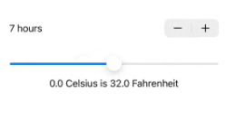

--------------------------- WeSplit-1 ---------------------
### Stop content from scrolling beyond top Safe Ares:
- Put the content inside of a NavigationStack and add the .navigationTitle("") on the content's container
```swift
struct ContentView: View {
    var body: some View {
        
        NavigationStack {
            Form {
                Section {
                    Text("Hello, World")
                }
                Section {
                    Text("Something")
                }
            }
            .navigationTitle("SwiftUI")
            .navigationBarTitleDisplayMode(.inline) // change the large font of the Navigation Title to small
        }
    }
}
```

### @State and Two Way Binding ($):
To be able to get a mutable variable `@State` property-wrapper (annotation).

It's said that `SwiftUI’s views are a function of their state`. So if state change the view will be updated.

`$ Two Way Binding` (Binding<Type>) - is used to change/mutate/read (Read/Write) the declared state variable inside and outside of the body property at the same time. using two way binding, the view is informed about the change on a defined State. Is done by `$stateName` inside of a body::view and declaration of @State var.
```swift
struct ContentView: View {

    let students = ["Harry", "Hermione", "Ron"]
    @State private var selectedStudent = "Harry"
    
    @State private var tapCount = 0
    
    @State private var name = ""
    
    var body: some View {
        
        NavigationStack {
            Form {
                TextField("Enter Your Name", text: $name) // Binding<Type> to Read/Write @State at the same time
                Text("Hello, World")
            }
            .navigationTitle("SwiftUI")
            .navigationBarTitleDisplayMode(.inline)
            
            // this tapCount is only reding the declared @State, not modifying/writing to it
            Button("Tap Count: \(tapCount)") {
                self.tapCount += 1
            }
        }
    }
}
```

### TextInput View:
This view is for input text
```swift
TextField("Enter your word", text: $newWord) // $newWord is 2 way binding with state. this will allow read/write from the same place and same time
    .textInputAutocapitalization(.never) // disable auto Capitalization
    .onSubmit(addNewWord) // run onSubmit
```

### Picker and ForEach with id: KeyPath<T> as (\Class.PropertyName
):
https://docs.swift.org/swift-book/documentation/the-swift-programming-language/expressions/#Key-Path-Expression
```swift
struct ContentView: View {
    
    let students = ["Harry", "Hermione", "Ron"]
    @State private var selectedStudent = "Harry"
    
    var body: some View {
        
        // using 2 way binding on $selectedStudent as bot read/write
        Picker("Select your Student", selection: $selectedStudent) {
            ForEach(students, id: \.self) { // \.self the the KeyPath for using key/id which refers to the students array's item 
                Text($0)
            }
        }      
    }
}
```

### @FocusState:
A property wrapper type that can read and write a value that SwiftUI updates as the placement of focus within the scene changes.
https://developer.apple.com/documentation/swiftui/focusstate
```swift
struct ContentView: View {
    
    @State private var checkAmount = 0.0
    
    @FocusState private var amountIsFocused: Bool
    
    var body: some View {
        NavigationStack {
            Form {
                Section {
                    TextField("Amount", value: $checkAmount, format: .currency(code: Locale.current.currency?.identifier ?? "USD"))
                        .keyboardType(.decimalPad)
                        .focused($amountIsFocused) // this will make the @FocusState True
                }
            }
            .toolbar { // this will show a done button on the top-right corner of the screen on the selected view (EditText this case) while on focused, and onClick will remove the focus and hide the soft keyboard.
                if amountIsFocused {
                    Button("Done") {
                        amountIsFocused = false
                    }
                }
            }
        }
    }
}
```
### Local to get User's Settings:
Locale is a massive struct built into iOS that is responsible for storing all the user’s region settings – what calendar they use, how they separate thousands digits in numbers, whether they use the metric system, and more.
Also, if not set, we can set default
```swift
TextField("Amount", value: $checkAmount, format: .currency(code: Locale.current.currency?.identifier ?? "USD"))
.keyboardType(.decimalPad) // .numberPad and .decimalPad will make the popup keyboard number only mode
```

### User's local data using @Environment:
```swift
@State private var amount = 0.0
@Environment(\.locale) private var local

TextField("Amount", value: $amount, format: .currency(code: local.currency?.identifier ?? "USD"))
```

### @/PropertyWrappers/Annotations commonly used:
`@AppStorage` reads and writes values from UserDefaults. This owns its data. More info.
`@Binding` refers to value type data owned by a different view. Changing the binding locally changes the remote data too. This does not own its data. More info.
`@Environment` lets us read data from the system, such as color scheme, accessibility options, and trait collections, but you can add your own keys here if you want. This does not own its data. More info.
`@EnvironmentObject` reads a shared object that we placed into the environment. This does not own its data. More info.
`@FetchRequest` starts a Core Data fetch request for a particular entity. This owns its data. More info.
`@FocusedBinding` is designed to watch for values in the key window, such as a text field that is currently selected. This does not own its data.
`@FocusedValue` is a simpler version of @FocusedBinding that doesn’t unwrap the bound value for you. This does not own its data.
`@GestureState` stores values associated with a gesture that is currently in progress, such as how far you have swiped, except it will be reset to its default value when the gesture stops. This owns its data. More info.
`@Namespace` creates an animation namespace to allow matched geometry effects, which can be shared by other views. This owns its data.
`@NSApplicationDelegateAdaptor` is used to create and register a class as the app delegate for a macOS app. This owns its data.
@ObservedObject refers to an instance of an external class that conforms to the ObservableObject protocol. This does not own its data. More info.
`@Published `is attached to properties inside an ObservableObject, and tells SwiftUI that it should refresh any views that use this property when it is changed. This owns its data. More info.
`@ScaledMetric `reads the user’s Dynamic Type setting and scales numbers up or down based on an original value you provide. This owns its data. More info.
`@SceneStorage `lets us save and restore small amounts of data for state restoration. This owns its data. More info.
`@State` lets us manipulate small amounts of value type data locally to a view. This owns its data. More info.
`@StateObject` is used to store new instances of reference type data that conforms to the ObservableObject protocol. This owns its data. More info.
`@UIApplicationDelegateAdaptor` is used to create and register a class as the app delegate for an iOS app. This owns its data. 

From : https://www.hackingwithswift.com/quick-start/swiftui/all-swiftui-property-wrappers-explained-and-compared


--------------------------- GuessTheFlag-2 ---------------------


### VStack, HStack and ZStack:
`VStack` for arranging things vertically.
`HStack` for arranging things horizontally
`ZStack` for arranging things by depth, draws its contents from top to bottom, back to front.
* Each Stack take same vertical space as its content.
* the size of the stack can be set using `.frame(maxWidth:maxHeight)` attaching with the stack.
* `.frame(maxWidth: .infinity, maxHeight: .infinity)` will make the stack as much space as possible.

Docs - https://developer.apple.com/tutorials/swiftui-concepts/adjusting-the-space-between-views
```swift
/**
 * A Screen With Fill with Red Color, including safe area and
 * 2 Vertical Rows  each with 2 Horizontal Columns
 * the order of modifier matters like
 * padding will not work if placed after backgorund
 */

struct ContentView: View {
    var body: some View {
        ZStack {
            Color.red.edgesIgnoringSafeArea(.all) // same as .ignoresSafeArea()
            VStack(spacing: 20) {
                HStack(spacing: 20) {
                    Text("Your content 1").padding(10).background(Color.orange)
                    Text("||")
                    Text("Your content 2").padding(10).background(Color.cyan)
                }
                .background(Color.white)
                .cornerRadius(10) // round corner
                
                HStack(spacing: 20) {
                    Text("Your content 3")
                    Text("||")
                    Text("Your content 4")
                }
                .padding(20) // the order of padding and background matters, will not work if placed after backgorund
                .background(Color.white)
                .cornerRadius(10)
            }
        }
    }
}
```
### Alignments (leading/top | center | trailing/bottom):
`HStack` has vertical alignment on it's constructor. To set Horizontal alignment, use `.frame(alignment: .leading)` or center/trailing for setting Vertical alignment. Same for VStack in opposite direction.
```swift
 HStack(alignment: .center, spacing: 0) {
    Text("When do you want to wake up?")
        .font(.headline)
        .frame(maxWidth: .infinity, alignment: .leading) // will start from start of the line and take as much space as possible including empty space
    
    DatePicker("Please enter a time", selection: $wakeUp, displayedComponents: .hourAndMinute)
        .labelsHidden()
        .frame(alignment: .trailing) // wil push the view to right end and as no maxWidth mentioned, take as much space as its content and give other view to grow
}
```
### Interesting Modifiers:
`cornerRadius` for rounded corner
`clipShape(Capsule())` for clipping with capsule shape (rounded corner effect)
`.background(.red.gradient)` prebuilt gradient on some color (to elevate the design)
`.shadow(radius: 7)` drop shadows
`.frame()` taking control of of a View's height/width and min/max, ex `Spacer().frame(height: 30)` 

### Interesting Views with Modifies:
- Gradient
```swift
LinearGradient(stops: [
    .init(color: .white, location: 0.45),
    .init(color: .black, location: 0.55),
], startPoint: .top, endPoint: .bottom)

RadialGradient(colors: [.blue, .black], center: .center, startRadius: 20, endRadius: 200)

AngularGradient(colors: [.red, .yellow, .green, .blue, .purple, .red], center: .center)
```

- Button and Click Action and Images
```swift
Button("Title", role: .destructive, action: executeDelete)
.buttonStyle(.bordered)
.tint(.mint)

func executeDelete() {
    print("Now deleting…")
}
```

- Image
`Image("pencil")` will load an image called “Pencil” that you have added to your project.
`Image(decorative: "pencil")` will load the same image, but won’t read it out for users who have enabled the screen reader. This is useful for images that don’t convey additional important information.
`Image(systemName: "pencil")` will load the pencil icon that is built into iOS. This uses Apple’s SF Symbols icon collection,
```Swift
// Button can have image too
Button {
    print("Edit button was tapped")
} label: { 
    Image(systemName: "pencil")
}

// also 
Button("Edit", systemImage: "pencil") {
    print("Edit button was tapped")
}
```

- Alerts
```swift
struct ContentView: View {
    @State private var showingAlert = false

    var body: some View {
        Button("Show Alert") {
            showingAlert = true
        }
        .alert("Important message", isPresented: $showingAlert) {
            Button("OK", role: .cancel) { }
        } message: {
            Text("Please read this.")
        }
    }
}
```


--------------------------- ViewsAndModifiers-3 ---------------------

### SwiftUI View Structure and Modifiers:
Almost every time we apply a modifier to a SwiftUI view, we actually create a new view with that change applied.

- Whats under the main view? -> `UIHostingController`, it is the bridge between UIKit (Apple’s original iOS UI framework) and SwiftUI. But its not for regular purpose use. like the size of the stack can be set using `.frame(maxWidth:maxHeight)` attaching with the stack. ex, `.frame(maxWidth: .infinity, maxHeight: .infinity)` will make the stack as much space as possible.

* the order of your modifiers matters.
we can use `print(type(of: self.body))` to inspect the view and modifiers underlying ViewClass<T>. Where ViewClass<T1, T2> is not same as ViewClass<T2, T1>.
```swift
Button("Hello, world!") {
    print(type(of: self.body))
}
.frame(width: 200, height: 200)
.background(.red)

// is not same as, later case background color will not applied to the new set dimension.
Button("Hello, world!") {
    print(type(of: self.body))
}
.background(.red)
.frame(width: 200, height: 200)
```

* Same Modifier for multiple times in combination: An important side effect of using modifiers is that we can apply the same effect multiple times: each one simply adds to whatever was there before.
```swift
Text("Hello, world!")
    .padding()
    .background(.red)
    .padding()
    .background(.blue)
    .padding()
    .background(.green)
    .padding()
    .background(.yellow)
```


### some View and Opaque Type Protocol:
Opaque Type Hide implementation details about a value’s type. Likw `: some View` is any type Struct that implements View Protocol. (NB, Structs cannot inherit from another struct, can only implement multiple protocols and class can do both)
docs: https://docs.swift.org/swift-book/documentation/the-swift-programming-language/opaquetypes/


### Conditional Modifiers:
Using Modifies Conditionally to generate value using ternary operators based on a @State is more efficient than Conditionally generate different views.
```swift
@State private var useRedText = false

var body: some View {
    Button("Hello World") {
        // flip the Boolean between true and false
        useRedText.toggle()            
    }
    .foregroundStyle(useRedText ? .red : .blue)
}

/**
* ternary conditional modifiers with @State is more efficient than
* conditional view generation
*/
var body: some View {
    if useRedText {
        Button("Hello World") {
            useRedText.toggle()
        }
        .foregroundStyle(.red)
    } else {
        Button("Hello World") {
            useRedText.toggle()
        }
        .foregroundStyle(.blue)
    }
}
```
### Environment Modifiers vs Regular Modifiers:
When applied to multiple views at a time, we can override/remove environment modifiers from the child view, but not regular modifiers. Regular modifier will adds effects any way. Like `.font` is a environment modifier, but `.blur` is regular.
```swift
// the fist text will override the container applied modifier
VStack {
    Text("Gryffindor")
        .font(.largeTitle)
    Text("Hufflepuff")
    Text("Ravenclaw")
    Text("Slytherin")
}
.font(.title)

// the first text will not override the container modifier, rather adds
VStack {
    Text("Gryffindor")
        .blur(radius: 1)
    Text("Hufflepuff")
    Text("Ravenclaw")
    Text("Slytherin")
}
.blur(radius: 6)
```

* NB: there is no way of knowing ahead of time which modifiers are environment modifiers and which are regular modifiers other than reading the individual documentation for each modifier

### Properties to store and compute Views:
View can be stored to Structs propety and can be used inside layout (body: some View). 
```swift
struct ContentView: View {
    let motto1 = Text("Draco dormiens")
    let motto2 = Text("nunquam titillandus")

    var body: some View {
        VStack {
            motto1
                .foregroundStyle(.red)
            motto2
                .foregroundStyle(.blue)
        }
    }
}
```

Computed properties of View can be created as well.
```swift
var motto1: some View {
    Text("Draco dormiens")
}
```
* Swift doesn’t let us create one stored property that refers to other stored properties, because it would cause problems when the object is created. This means trying to create a TextField bound to a local property will cause problems.

But unlike the body property, Swift won’t automatically apply the @ViewBuilder attribute here, so if you want to send multiple views back you have three options.
```swift
// 1
var spells: some View {
    VStack {
        Text("Lumos")
        Text("Obliviate")
    }
}

// 2
var spells: some View {
    Group {
        Text("Lumos")
        Text("Obliviate")
    }
}

// 3
@ViewBuilder var spells: some View {
    Text("Lumos")
    Text("Obliviate")
}
```
### View Composition:
SwiftUI lets us break complex views down into smaller views without incurring much if any performance impact.
```swift
struct CapsuleText: View {
    var text: String

    var body: some View {
        Text(text)
            .font(.largeTitle)
            .padding()
            .background(.blue)
    }
}

struct ContentView: View {
    var body: some View {
        VStack(spacing: 10) {
            CapsuleText(text: "First")
                .foregroundStyle(.white)
            CapsuleText(text: "Second")
                .foregroundStyle(.yellow)
        }
    }
}
```

### Custom Modifiers:
To create a custom modifier, create a new struct that conforms to the ViewModifier protocol. This has only one requirement, which is a method called body that accepts whatever content it’s being given to work with, and must return some View. And hook it using `.modifier(YourCustomModifier)`

```swift
struct CustomModifier: ViewModifier {
    func body(content: Content) -> some View {
        content
            .font(.largeTitle)
            .foregroundStyle(.white)
            .padding()
            .background(.blue)
            .clipShape(.rect(cornerRadius: 10))
    }
}

// use the Custom Modifiers
Text("Hello World")
    .modifier(CustomModifier())
```

### Custom Modifiers With View Extension:
Extension on View (``) can be created to use the custom defined modifier in more customized way.
```swift
// Using custom modifier
struct ContentView: View {
    var body: some View {   
        Text("Hello World")
            .myCustomStyle()
    }
}

// attaching custom modifier with `extension View`
extension View {
    func myCustomStyle() -> some View {
        modifier(MyCustoModifier())
    }
}

// defining custom modifier with ViewModifier Protocol Implementation
struct MyCustoModifier: ViewModifier {
    func body(content: Content) -> some View {
        content
            .font(.largeTitle)
            .foregroundStyle(.white)
            .padding()
            .background(.blue)
            .cornerRadius(10)
    }
}
```
* custom view modifiers can have their own stored properties, whereas extensions to View cannot. So sometimes it’s better to add a custom view modifier versus just adding a new method to View

### Custom Container View (Stacks):
We can create custom Stack Container based on built-in Stacks and Views.
```swift
struct GridStack<Content: View>: View {
    let rows: Int
    let columns: Int
    // let content: (Int, Int) -> Content
    // adds more flexibility to return multiple view with @ViewBuilder wrapper, so we don't need to place the content inside another Stack to return multiple view when applying
    @ViewBuilder let content: (Int, Int) -> Content

    var body: some View {
        VStack {
            ForEach(0..<rows, id: \.self) { row in
                HStack {
                    ForEach(0..<columns, id: \.self) { column in
                        content(row, column)
                    }
                }
            }
        }
    }
}

// Use the custom Container
struct ContentView: View {
    var body: some View {
        GridStack(rows: 4, columns: 4) { row, col in
            Image(systemName: "\(row * 4 + col).circle")
            Text("R\(row) C\(col)")
        }
    }
}
```

--------------------------- Better-Rest-4 ---------------------

### Stepper & Slider View:



```swift
struct ContentView: View {
    
    @State private var sleepAmount = 7.0
    @State private var celsius: Double = 0
    
    var body: some View {
        VStack(){

            Stepper("\(sleepAmount.formatted()) hours", value: $sleepAmount, in: 4...12, step: 0.25)

            Spacer().frame(height: 30)
            
            Slider(value: $celsius, in: -100...100)
                        Text("\(celsius, specifier: "%.1f") Celsius is \(celsius * 9 / 5 + 32, specifier: "%.1f") Fahrenheit")
        }
        .padding()
    }
}
```

### Date Handling (DateComponent) and Date Picker:
As Date is a complicated topic (there are lot of factor, daylight saving, region, timezone, etc), Using users `Calender` with `DateComponent` and the `Date` in combination works good
```swift
struct ContentView: View {
    
    init() {
        print("From inti")
        dateCalculation()
    }
    
    var body: some View {
        VStack(){
            Text("Testing Date, Date Component and Calender For Time Difference Calculation")
        }
        .padding()
    }
    
    func dateCalculation() -> Void {
        
        /**
         * Using Calender and Date to get tomorrows time
         * Date component is used in 2nd example
         */
        
        let calendar = Calendar.current
        // Use the following line if you want midnight UTC instead of local time
        //calendar.timeZone = TimeZone(secondsFromGMT: 0)
        let timenow = Date()
        print(timenow.formatted(date: .long, time: .shortened))
        print(Date.now.formatted(date: .long, time: .shortened))
        let startOfToday = calendar.startOfDay(for: timenow)
        print(startOfToday.formatted(date: .long, time: .shortened))
        let startOfTomorrow = calendar.date(byAdding: .day, value: 1, to: startOfToday)!

        let todayStartEpoch = startOfToday.timeIntervalSince1970
        let tomorrowStartEpoch = startOfTomorrow.timeIntervalSince1970
        
        print("midnightEpoch : \(todayStartEpoch) and tomorrowEpoch \(tomorrowStartEpoch)")
        print("diff tomorrow - midnight = \((tomorrowStartEpoch-todayStartEpoch) / 3600) hours")
        
        
        
        /**
         * Challenge : Get the time diff from now to tomorrow 7am
         * and show the diff in year month day hour min format
         * Date, Date Component and Calender is used
         */
        
        let calenderTodayC = Calendar.current // get iser's current calender
        let calenderToday : DateComponents = calenderTodayC.dateComponents(in: .current, from: Date.now)
        
        print("calenderToday props => hour : \(calenderToday.hour!), day:  \(calenderToday.day!), month :  \(calenderToday.month!), year : \(calenderToday.year!)")
        
        /***
         * Building Date Component For Next Day Morning 7am
         */
        var dateCompTomorroMorning7 = DateComponents()
        dateCompTomorroMorning7.hour = 7
        dateCompTomorroMorning7.day = calenderToday.day! + 1
        dateCompTomorroMorning7.minute = 0
        dateCompTomorroMorning7.second = 0
        dateCompTomorroMorning7.year = calenderToday.year
        dateCompTomorroMorning7.month = calenderToday.month
        
        // inject date component into calender to build tomorrow's date at 7
        let tomorrowMorning7: Date? = calenderTodayC.date(from: dateCompTomorroMorning7)
        
        if let tomorrow7 = tomorrowMorning7 {
            print("tomorrowMorning7 : \(tomorrow7.formatted(date: .long, time: .shortened))")
        }
        
        // calculate time diff from now to tomorrow 7, converted to Int to work easily with `%` reminder operator
        let timeDiff = Int(tomorrowMorning7!.timeIntervalSince1970 - Date.now.timeIntervalSince1970)
        let seconds = timeDiff % 60
        let minutes = (timeDiff / 60) % 60
        let hours = (timeDiff / 3600)
        let day = timeDiff / (3600 * 24)
        print("Tomorrow 7am is \(day) day,  \(hours) hours,  \(minutes) minutes, and  \(seconds) seconds away form now")
    }
}
```
note https://stackoverflow.com/questions/54084023/how-to-get-the-todays-and-tomorrows-date-in-swift-4

### Working With CoreML and CreateML:
Machine Learning Model Training can be done using CreateML `xcode -> open developers tool -> CreateML`, and a CoreML model training can be done through there. The generated file will be on `.mlmodel` format. The generated file need to be placed inside project directory (same level as `ContentView.swift`), not in xcassets. The xcode will generate required class automatically, which can be used by the `filename`.
```swift
// CoreML Demo
import CoreML
import SwiftUI

struct ContentView: View {
    
    @State private var wakeUp = defaultWakeTime
    @State private var sleepAmount = 8.0
    @State private var coffeeAmount = 1
    
    // state for alerting
    @State private var alertTitle = ""
    @State private var alertMessage = ""
    @State private var showingAlert = false
    
    // computed property for defaultWakeTime
    static var defaultWakeTime: Date {
        var components = DateComponents()
        components.hour = 7
        components.minute = 0
        return Calendar.current.date(from: components) ?? .now
    }
    
    var body: some View {
        NavigationStack {
            ZStack {
                Color(UIColor.lightGray)
                    .brightness(0.27)
                    .edgesIgnoringSafeArea(.bottom)
                VStack {
                    HStack(alignment: .center, spacing: 0) {
                        Text("When do you want to wake up?")
                            .font(.headline)
                            .frame(maxWidth: .infinity, alignment: .leading)
                        
                        DatePicker("Please enter a time", selection: $wakeUp, displayedComponents: .hourAndMinute)
                            .labelsHidden()
                            .frame(alignment: .trailing)
                    }
                    
                    VStack(alignment: .leading, spacing: 0) {
                        Text("Desired amount of sleep")
                            .font(.headline)
                        
                        Stepper("\(sleepAmount.formatted()) hours", value: $sleepAmount, in: 4...12, step: 0.25)
                    }
                    
                    
                    VStack(alignment: .leading, spacing: 0) {
                        Text("Daily coffee intake")
                            .font(.headline)
                        
                        //                    Stepper(coffeeAmount == 1 ? "1 cup" : "\(coffeeAmount) cup(s)", value: $coffeeAmount, in: 1...20)
                        
                        // let swift handle the pluralization using markdown syntax
                        Stepper("^[\(coffeeAmount) cup](inflect: true)", value: $coffeeAmount, in: 1...20)
                    }
                }
                .navigationTitle("BetterRest")
                .navigationBarTitleDisplayMode(.inline)
                .toolbar {
                    Button("Calculate", action: calculateBedtime)
                }
                .padding()
                .alert(alertTitle, isPresented: $showingAlert) {
                    Button("OK") { }
                } message: {
                    Text(alertMessage)
                }
            }
        }
        
    }
    
    func calculateBedtime() {
        // create coreml config and get the model
        // the model will be generated based on the filename.mlmode
        do {
            let config = MLModelConfiguration()
            let model = try SleepCalculator(configuration: config)
            
            let components = Calendar.current.dateComponents([.hour, .minute], from: wakeUp)
            let hour = (components.hour ?? 0) * 60 * 60
            let minute = (components.minute ?? 0) * 60
            
            let prediction = try model.prediction(wake: Double(hour + minute), estimatedSleep: sleepAmount, coffee: Double(coffeeAmount))
            
            let sleepTime = wakeUp - prediction.actualSleep
            
            alertTitle = "Your ideal bedtime is…"
            alertMessage = sleepTime.formatted(date: .omitted, time: .shortened)
            
            
        } catch {
            alertTitle = "Error"
            alertMessage = "Sorry, there was a problem calculating your bedtime."
        }
        
        showingAlert = true
    }
}
```


--------------------------- WordScramble-5 ---------------------


### List (UIKit's UITableView):
one thing List can do that Form can’t is to generate its rows entirely from dynamic content without needing a ForEach.
```swift
List(0..<5) {
    Text("Dynamic row \($0)")
}
```

* List with id
```swift
struct ContentView: View {
    let people = ["Finn", "Leia", "Luke", "Rey"]

    var body: some View {
        List(people, id: \.self) {
            Text($0)
        }
    }
}
```
### URL and File Read/Write and Strings:
`if let fileURL = Bundle.main.url(forResource: "some-file", withExtension: "txt"){}` is used to fetch the url.

Once the file's url returned, `if let fileContents = try? String(contentsOf: fileURL) {}` is used to read the file

Strings can be converted into array
```swift
let input = "a b c"
let letters = input.components(separatedBy: " ") // ["a", "b", "c"]

// or from line brakes
let input = """
            a
            b
            c
            """
let letters = input.components(separatedBy: "\n")
```

randomize array with the `let letter = letters.randomElement()`

trimming strings -> `let trimmed = letter?.trimmingCharacters(in: .whitespacesAndNewlines)`

`UITextChecker` is used to check for misspelled words. It's from UIKIt and built in Objective-C (Any class starting with UI..... in front are usually from UIKit, SwiftUI has UIKit's classes auto access)
```swift
// Text checker examples.
let word = "swift"
let checker = UITextChecker() // comes form UIKit and Objective-C

// asking Swift to create an Objective-C string range using the entire length of all our characters
let range = NSRange(location: 0, length: word.utf16.count)

// misspellings in our word, if no error found, will return NSNotFound,
// Objective-C has no Optional?, so we have to deal with that
let misspelledRange = checker.rangeOfMisspelledWord(in: word, range: range, startingAt: 0, wrap: false, language: "en")
let allGood = misspelledRange.location == NSNotFound
```


--------------------------- Animation-6 ---------------------


### Basic Animation:
* Swift animates by observing a before state and an after state. 
Usually animation is applied with the `.animation` modifier, including this and all the property bind with the @State will trigger animation when it (@State) changes.

```swift
// Defining a minimal Button, which will animate the scale and blur based on the @State change, and the effect will be applied based on the `.animation()` Modifier.
struct ContentView: View {
    
    @State private var animationAmount = 1.0
    
    var body: some View {
        VStack {
            Button("Tap Me") {
                if(animationAmount < 4) {
                    animationAmount += 1
                } else {
                    animationAmount = 1
                }
            }
            .padding(50)
            .background(.red)
            .foregroundStyle(.white)
            .clipShape(Circle())
            .scaleEffect(animationAmount) // will scale the Button 1x, 2x, 3x, etc
            .blur(radius: (animationAmount - 1) * 3)
            .animation(.default, value: animationAmount) // animate the value of `animationAmount`
        }
        .padding()
    }
}
```

`.animation(.linear, ...)`, `animation(.spring(duration, bounce), value: @State)` ect are also available
```swift
.animation(.linear, value: animationAmount)

.animation(.spring(duration: 1, bounce: 0.9), value: animationAmount)

.animation(
    .easeInOut(duration: 2)
        .delay(1),
    value: animationAmount
)

.animation(
    .easeInOut(duration: 1)
        .repeatCount(3, autoreverses: true),
    value: animationAmount
)

.animation(
    .easeInOut(duration: 1)
        .repeatForever(autoreverses: true),
    value: animationAmount
)
```

* We can use these `repeatForever()` animations in combination with `onAppear()` to make animations that start immediately and continue animating for the life of the view.

`overlay()` modifier lets us create new views at the same size and position as the view we’re overlaying.
```swift
// Starting an overlay animation on Start using state change inside onAppear mod
Button("Tap Me") {
    // animationAmount += 1
}
.padding(50)
.background(.red)
.foregroundStyle(.white)
.clipShape(.circle)
.overlay(
    Circle()
        .stroke(.red)
        .scaleEffect(animationAmount)
        .opacity(2 - animationAmount)
        .animation(
            .easeInOut(duration: 1)
                .repeatForever(autoreverses: false),
            value: animationAmount
        )
)
.onAppear {
    animationAmount = 2
}
```

### Using WithAnimation:
```swift
struct ContentView: View {
    @State var scale = 1.0

    var body: some View {
        Circle()
            .frame(width: 200, height: 200)
            .scaleEffect(scale)
            .onAppear {
                let baseAnimation = Animation.easeInOut(duration: 1)
                let repeated = baseAnimation.repeatForever(autoreverses: true)

                withAnimation(repeated) {
                    scale = 0.5
                }
            }
    }
}
```
### Two way Binding and Animation:
2 Way Binding with animation() modifier, we don’t need to specify which value we’re watching for changes – it’s literally attached to the value it should watch!
```swift
struct ContentView: View {
    @State private var animationAmount = 1.0

    var body: some View {
        VStack {
            Stepper("Scale amount", value: $animationAmount.animation(), in: 1...10)

            Spacer()

            Button("Tap Me") {
                animationAmount += 1
            }
            .padding(40)
            .background(.red)
            .foregroundStyle(.white)
            .clipShape(.circle)
            .scaleEffect(animationAmount)
        }
    }
}
```

* animation with 2 way binding can take config as well
```swift
Stepper("Scale amount", value: $animationAmount.animation(
    .easeInOut(duration: 1)
        .repeatCount(3, autoreverses: true)
), in: 1...10)
```
### Explicit Animation Using WithAnimation:
```swift
struct ContentView: View {
    
    @State private var animationAmount = 1.0
    @State private var startAnim = false
    
    var body: some View {
        VStack {
            Button("Tap Me") {
                
//                withAnimation {
//                    animationAmount += 360
//                }
                
                withAnimation(.spring(response: 2, dampingFraction: 1)) {
                    animationAmount += 360
                }
            }
            .padding(50)
            .background(.red)
            .foregroundStyle(.white)
            .clipShape(Circle())
            .onAppear {
//                withAnimation (.default.repeatCount(7)) {
//                    animationAmount += 360
//                }
            }
            .rotation3DEffect(.degrees(animationAmount), axis: (x: 0, y: 1, z: 0))
        }
        .padding()
    }
}
```

### Animation Stack (Controlling multiple animation effects):
Because `modifier order matters`, we can attach multiple animations, those will affect differently/independently to the modifiers those comes before the declared `animation(...)` modifiers.
```swift
struct ContentView: View {

    @State private var enabled = false
    
    var body: some View {
        VStack {
            Button("Tap Me") {
                enabled.toggle()
            }
            .padding(50)
            .background(enabled ? .red : .blue)
            .foregroundStyle(.white)
            .animation(.easeInOut(duration: 1), value: enabled)
            .clipShape(RoundedRectangle(cornerRadius: enabled ? 60 : 0))
            .animation(.spring(response: 1, dampingFraction: 1), value: enabled)
        }
        .padding()
    }
}
```
### Dragging Gesture:
To make a view draggable, add a @State first (of type `CGSize`, like CGSize.zero for initial state) to store the position of the drag. Then attach the `offset(@State)` modifier to move the view and a `gesture(...)` modifier to track user gesture.
```swift
struct SecondView : View {
    
    @State private var dragAmount = CGSize.zero
    
    var body: some View {
        VStack {
            LinearGradient(colors: [.yellow, .red], startPoint: .topLeading, endPoint: .bottomTrailing)
                .frame(width: 300, height: 200)
                .clipShape(RoundedRectangle(cornerRadius: 10))
                .offset(dragAmount)
                .gesture(
                    DragGesture()
                        .onChanged { dragAmount = $0.translation }
                        .onEnded { _ in dragAmount = .zero }
                )
        }
    }
}
```
### Animation on Drag Gestures:
```swift
struct GestureAnimaitonBoxDrag : View {
    
    @State private var dragAmount = CGSize.zero
    
    var body: some View {
        VStack {
            LinearGradient(colors: [.yellow, .red], startPoint: .topLeading, endPoint: .bottomTrailing)
                .frame(width: 300, height: 200)
                .clipShape(RoundedRectangle(cornerRadius: 10))
                .offset(dragAmount)
                .gesture(
                    DragGesture()
                        .onChanged { dragAmount = $0.translation }
                        .onEnded { _ in
                            // this will allow to animate only the last part
                            withAnimation(.spring()) {
                                dragAmount = .zero
                            }
                            
                        }
                )
                // .animation(.easeInOut, value: dragAmount)
                // removing the both way animation with only onEnded part by withAnimation inside the callback
        }
    }
}
```

### Text Drag Gesture Animation (Snake Effect onDrag):
```kotlin
struct TextGestureAnimation: View {
    let letters = Array("Hello SwiftUI")
    @State private var enabled = false
    @State private var dragAmount = CGSize.zero
    
    var body: some View {
        HStack(spacing: 0) {
            ForEach(0..<letters.count, id: \.self) { num in
                Text(String(letters[num]))
                    .padding(5)
                    .font(.title)
                    .background(enabled ? .blue : .red)
                    .offset(dragAmount)
                    .animation(.linear.delay(Double(num) / 20), value: dragAmount)
            }
        }
        .gesture(
            DragGesture()
                .onChanged { dragAmount = $0.translation }
                .onEnded { _ in
                    dragAmount = .zero
                    enabled.toggle()
                }
        )
    }
}
```

### `.transition` modifier and conditional View Toggle animation:
```swift
struct ConditionalViewToggleAnim: View {
    
    // @State var isShowingRed: Bool
    @State var isShowingRed = false
    
    /*
        init () {
            /**
             * if any member is not assigned with value and not a computed property then
             * the property needs to either be assaign in init block or as constructor parameter while instantiating
             */
            isShowingRed = false
        }
    */
    
    var body: some View {
        VStack {
            Button("Tap Me") {
                withAnimation {
                    isShowingRed.toggle()
                }
            }
            
            if isShowingRed {
                Rectangle()
                    .fill(.red)
                    .frame(width: 200, height: 200)
                    // .transition(.scale)
                    .transition(.asymmetric(insertion: .scale, removal: .opacity))
            }
        }
        
    }
}
```
### Custom transition with Custom Modifier:
Custom transition animation is made possible by the .modifier transition, which accepts any view modifier we want. But we need to be able to instantiate the modifier, which means the `.modifier` needs to be one we create ourselves (custom modifier implementation).
```swift
struct CustomTransitionAnim: View {
    
    @State private var isShowingRed = false
    
    var body: some View {
        VStack {
            Rectangle()
                .fill(.blue)
                .frame(width: 200, height: 200)
            
            if isShowingRed {
                Rectangle()
                    .fill(.red)
                    .frame(width: 200, height: 200)
                    .transition(.pivot)
            }
        }
        .onTapGesture {
            withAnimation {
                isShowingRed.toggle()
            }
        }
    }
}

/* Define Custom Modifier */
struct CornerRotateModifier: ViewModifier {
    let amount: Double
    let anchor: UnitPoint
    
    func body(content: Content) -> some View {
        content
            .rotationEffect(.degrees(amount), anchor: anchor)
            .clipped()
    }
}

/* Define extension on AnyTransition */
extension AnyTransition {
    static var pivot: AnyTransition {
        .modifier(
            active: CornerRotateModifier(amount: -90, anchor: .topLeading),
            identity: CornerRotateModifier(amount: 0, anchor: .topLeading)
        )
    }
}
```

### Combine transition:
https://www.hackingwithswift.com/quick-start/swiftui/how-to-combine-transitions

### AnyTransition in SwiftUI:
https://jacobko.info/swiftui/swiftui-26/#anytransition-in-swiftui

### @escaping in Swift:
https://docs.swift.org/swift-book/documentation/the-swift-programming-language/closures/#Escaping-Closures


--------------------------- iExpense-7 ---------------------


### Class for shared data between Views:
if we want two or more views to point to the same data so that when one changes they all get those changes – we need to use classes rather than structs.

As structs are value base, so when assigned/shared a same instance of a struct, its different every case. But classes are reference based, assigning/sharing same instance with multiple variable reference the same instance, so if value is changed in a reference, it will change in other references too.

```swift
class StudentClass {
   var name: String
   init(name: String) {
      self.name = name
   }
}

let student1 = StudentClass(name: "X")
let student2 = student1

student2.name = "Y" // this will also make the student1 name "Y", as classes are references based

print("student1 name: \(student1.name)") // Y
print("student2 name: \(student2.name)") // Y

struct StudentStruct {
   var name: String
}
let student3 = StudentStruct(name: "X")
var student4 = student3
student4.name = "Y" // this will not change the student3 name, as Structures are value based
print("student3 name: \(student3.name)") // X
print("student4 name: \(student4.name)") // Y
```


### Using Class For Sharing @State:
`Structs` always have unique owners, so if we have two SwiftUI views and we send them both the same struct to work with, they actually each have a unique copy of that struct, if one changes it, the other won’t see that change. On the other hand, if we create an instance of a class and send that to both views, they will share changes.

- How @State works in struct and Class
With Struct, every time we modified a property of that struct Swift was actually creating a new instance of the struct. @State was able to spot that change, and automatically reloaded our view. When we have a class, that behavior no longer happens: Swift can just modify the value directly.

`mutating` keyword is prefixed with struct methods to modify properties. This is because if we create the struct’s properties as variable but the struct itself is constant (Unchangeable), we can’t change the properties – Swift needs to be able to destroy and recreate the whole struct when a property changes, and that isn’t possible for constant structs. Classes don’t need the mutating keyword, because even if the class instance is marked as constant Swift can still modify variable properties.

* Also, for classes, if internal property changes, @State doesn't automatically observe those changes. To make track any changes, we need to mark the class with `@Observable`

```swift 
struct ContentView: View {
    @State private var user = DataClass()
    var body: some View { /* View def */ }
}


/* telling if any @State is pointing to this class should be observed for changes by annotating with the @Observable property wrapper */
@Observable
class DataClass {/* props and other definitions */}
```

### Macro , @Observable and Observation import:
`Macro` -> adds extra functionality behind the scene to the annotated wrapper `@...` clode block. `@Observable` property-wrapper/annotation is a macro. It add more code to provide desired Observation functionality behind the scene.

xcode can reveal what is happening by using the `@Observable` macro annotation with a class by using a `import Observation` declaration. Then right click on the @Observable and choose `Expand Macro` to see the details

Example of the `@Observable` macro
```swift
// Original Block
@Observable
class User {
    var firstName  = "Bilbo"
    
    var lastName = "Baggins"
}


// Expanded Macro
import Observation

@Observable
class User {
    @ObservationTracked  /* its a macro too */
    var firstName  = "Bilbo"

    @ObservationTracked  /* its a macro too */
    var lastName = "Baggins"

    @ObservationIgnored private let _$observationRegistrar = Observation.ObservationRegistrar()

    internal nonisolated func access<Member>(
        keyPath: KeyPath<User , Member>
    ) {
    _$observationRegistrar.access(self, keyPath: keyPath)
    }

    internal nonisolated func withMutation<Member, MutationResult>(
    keyPath: KeyPath<User , Member>,
    _ mutation: () throws -> MutationResult
    ) rethrows -> MutationResult {
    try _$observationRegistrar.withMutation(of: self, keyPath: keyPath, mutation)
    }
}
extension User: Observation.Observable {
}
```

### Showing and Hiding View Using Sheets:
Sheet are card-like presentation where the current view slides away into the distance a little and the new view animates in on top.
Sheets work much like alerts, but instead of like `alert.present()`, we define the conditions under which a sheet should be shown.

```swift
struct SheetsConditional: View {
    
    @State private var showingSheet = false
    
    var body: some View {
        Button("Show Sheet") {
            showingSheet.toggle()
        }
        .sheet(isPresented: $showingSheet) {
            SecondView(name: "@twostraws")
        }
    }
}

struct SecondView: View {
    
    // using @Environment wrapper for self destruction (this view)
    @Environment(\.dismiss) var dismiss
    
    let name: String
    
    var body: some View {
        VStack {
            Text("Hello, \(name)!")
            Button("Dismiss") {
                dismiss()
            }
        }
    }
}
```

### KeyPath and KeyPath Expression `\`:
The most common way to make an instance of this type is by using a key-path expression like \SomeClass.someProperty. And the expression signature is `\<#type name#>.<#path#>`
```swift
struct SomeStructure {
    var someValue: Int
}


let s = SomeStructure(someValue: 12)
let pathToProperty = \SomeStructure.someValue

/* Using keyPath Subscript which is available on all types */
let value = s[keyPath: pathToProperty]
// value is 12
```

Docs: https://developer.apple.com/documentation/swift/keypath
* Docs: https://docs.swift.org/swift-book/documentation/the-swift-programming-language/expressions/#Key-Path-Expression


### @Environment and Dismiss a View:
Use the Environment property wrapper to read a value (but cannot set) stored in a view’s environment. Indicate the value to read using an `EnvironmentValues` key path in the property declaration. Signature `@Environment(\EnvironmentValues.prop) var variableName: Type`

All the available keyPath for using in @Environment are here -> https://developer.apple.com/documentation/swiftui/environmentvalues

```swift
/**
* Showing another view conditionally using Sheets
* And also dismissing that using @Environment Property wrapper
*/

struct SheetsConditional: View {
    
    @State private var showingSheet = false
    
    var body: some View {
        Button("Show Sheet") {
            showingSheet.toggle()
        }
        .sheet(isPresented: $showingSheet) {
            SecondView(name: "@twostraws")
        }
    }
}

struct SecondView: View {
    
    // using @Environment wrapper for self destruction (this view)
    @Environment(\EnvironmentValues.dismiss) var dismiss
    
    // var dismissActionKeyPath: KeyPath<EnvironmentValues, DismissAction> = \EnvironmentValues.dismiss
    
    let name: String
    
    var body: some View {
        VStack {
            Text("Hello, \(name)!")
            Button("Dismiss") {
                dismiss()
            }
        }
    }
}
```
If the value changes, SwiftUI updates any parts of your view that depend on the value. 

@Environment Docs: https://developer.apple.com/documentation/swiftui/environment
EnvironmentValue Docs: https://developer.apple.com/documentation/swiftui/environmentvalues

### Deleting Items Wid Swipe Delete and .toolbar:EditButton :
SwiftUI provides some builtin Modifier and function to delete list items by swiping or select delete.

This example creates a view where user can add numbers to the screen and delete it by swiping left or an Edit button on toolbar to select and delete multiple items at once.
```swift
struct DeletingItem: View {
    @State private var numbers = [Int]()
    @State private var currentNumber = 1
    
    var body: some View {
       NavigationStack {
            VStack {
                List {
                    ForEach(numbers, id: \.self) {
                        Text("Row \($0)")
                    }
                    .onDelete(perform: { indexSet in
                        numbers.remove(atOffsets: indexSet)
                    })
                }
                
                Button("Add Number") {
                    numbers.append(currentNumber)
                    currentNumber += 1
                }
            }
            .toolbar(content: {
                EditButton()
            })
        }
    }
}
```

### UserDefaults for storing user setting/data and @AppStorage:
UserDefault is suitable for storing small amount of data. There is no limit set, but as everything will loads while app opens, storing big data could slow app initialization. Best to be lower than 512KB.

@AppStorage can Wrap-up the UserDefaults, which provide more simpler property storage option.

```swift
struct ContentView: View {
    /** Reading form UserDefaults
     * if the key can’t be found on first run
     * it just sends back 0
     * with boolean(forKey:) false will be returned initially
     */
    @State private var tapCount = UserDefaults.standard.integer(forKey: "Tap")
    
    var body: some View {
        Button("Tap count: \(tapCount)") {
            tapCount += 1
            /* Setting UserDefault Value is a Key */
            UserDefaults.standard.set(tapCount, forKey: "Tap")
        }
    }
}
```

@AppStorage is even simpler, but it needs default value. Also it doesn't support storing Custom types.
```swift
struct ContentView: View {
    @AppStorage("tapCount") private var tapCount = 0

    var body: some View {
        Button("Tap count: \(tapCount)") {
            tapCount += 1
        }
    }
}
```

* Note on AppStore Submission: Apple asks that you let them know why you're loading and saving data using UserDefaults. This also applies to the @AppStorage property wrapper. They just want to make sure developers aren't trying to identify users across apps.

### Codable and Object Archiving with JSONEncoder/Decoder:
```swift
struct User: Codable {
    let firstName: String
    let lastName: String
}

struct ContentView: View {
    @State private var user = User(firstName: "Taylor", lastName: "Swift")

    var body: some View {
       Button("Save User") {
            let encoder = JSONEncoder()

            if let data = try? encoder.encode(user) {
                UserDefaults.standard.set(data, forKey: "UserData")
            }
        }
    }
}
```
### List/ForEach KeyPath and Identifiable with UUID:
ForEach in SwiftUI require an id (a keyPath of that type) or the type (custom type/struct) must conform to `Identifiable` protocol. To make a struct successfully implement `Identifiable`, it should have a unique `id` property. We can use `UUID` easily to gen that.
```swift
struct ExpenseItem: Identifiable {
    let id = UUID()
    let name: String
    let type: String
    let amount: Int
}

// inside view implementing/conforming struct
let expensesArray: Array<ExpenseItem> = [ExpenseItem(name: "Test", type: "Personal", amount: 5), ExpenseItem(name: "Test", type: "Personal", amount: 5)]
/* swift's regular collection types are arrays, sets, and dictionaries, no list type*/

var body: some View {
    List {
        ForEach(expensesArray) { item in
            Text(item.name)
        }
    }
}
```